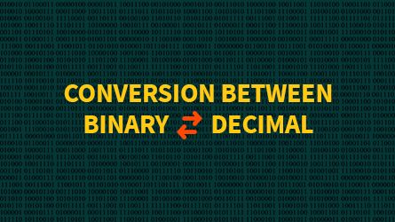

<h1> Converting Decimals to Binary </h1> 
<h6> Created by Lukas Hinson </h6>
 

 This tutorial will teach on how to convert decimals to binary numbers and vice versa. My goal for this tutorial is for it be easy to understand and easy to use. 

 The target audience for this tutorial will be anyone needing to convert decimal to binary or binary to decimal! 

 

[Please watch this video if you need more help!](https://www.youtube.com/embed/rsxT4FfRBaM)
