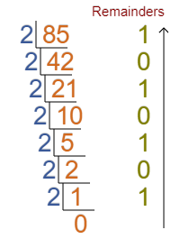
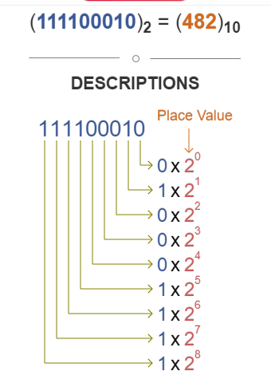

<h1> Converting Decimals to Binary </h1> 
<h6> Created by Lukas Hinson </h6>
 

 This tutorial will teach on how to convert decimals to binary numbers and vice versa. My goal for this tutorial is for it be easy to understand and easy to use. 

 The target audience for this tutorial will be anyone needing to convert decimal to binary or binary to decimal! 

 
<h2> Now time for the tutorial to convert decimal to binary </h2>
<ol>
  <li>Write down the decimal number.</li>
  <li>Divide the number by 2.</li>
  <li>Write the result underneath.</li>
  <li>Write the remainder on the right side. (This will be 1 or 0) </li>
  <li>Continue dividing and writing down remainders until the result of the division is 0.</li>
  <li>Read the numbers from bottom up. That will be the binary equivalent to the decimal number. </li>
</ol>

<h2> An example worked out! </h2>

 

<h2>Tutorial on turning binary numbers to decimal numbers.</h2>
<ol>
  <li>Write down the binary number.</li>
  <li>Starting from the left, double your previous total and add the current digit.</li>
  <li>Double your current total and add the next leftmost digit.</li>
  <li>Repeat the previous step.</li>
</ol>

<h2> Another example worked out </h2>

[Click here if you need more help!](https://www.youtube.com/embed/rsxT4FfRBaM)

